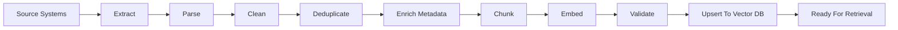
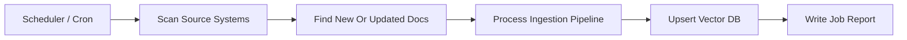
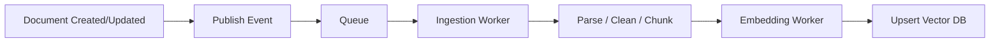
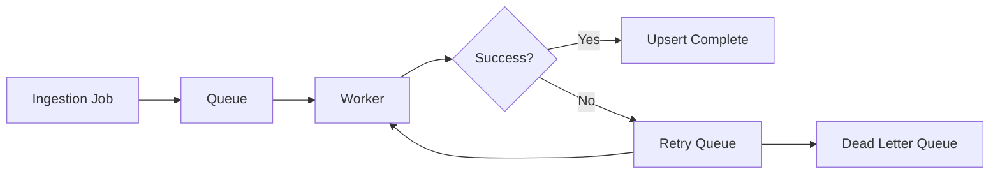
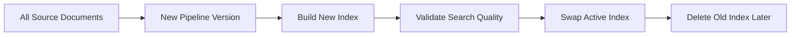

# Enterprise Offline Ingestion Pipeline Canvas

## Goal

Prepare enterprise knowledge so it can be searched by meaning and used later by RAG/chat systems.

## Pipeline



## Execution Patterns

Enterprise ingestion is usually not done inside the user chat request. It runs as offline or background work.

### 1. Scheduled Batch

Use when data changes slowly or predictable freshness is enough.



Example:

```text
Run every night at 2 AM.
Index new policies, updated wiki pages, and recent tickets.
```

### 2. Event-Driven Async Workers

Use when documents should become searchable soon after they change.



Example:

```text
A support article is updated.
CMS publishes an event.
Worker re-embeds only that article.
```

### 3. Queue With Retries

Use when parsing, embedding, or DB writes can fail and should be retried safely.



Example:

```text
If embedding API times out, retry later.
If the same job fails repeatedly, send it to a dead letter queue for review.
```

### 4. Full Rebuild

Use when changing embedding model, chunking strategy, metadata schema, or vector DB.



Example:

```text
Move from text-embedding-3-small to text-embedding-3-large.
Recreate all embeddings because old and new vectors should not be mixed.
```

## Stages

| Stage | What Happens | Example Output |
|---|---|---|
| Source Systems | Collect data from docs, tickets, wikis, PDFs, DBs, websites | `refund-policy.pdf`, `support-ticket-123.json` |
| Extract | Pull raw content from each source | raw text, file metadata |
| Parse | Convert formats into readable text | PDF to text, HTML to text, JSON fields to text |
| Clean | Remove noise and normalize text | fixed spacing, removed boilerplate |
| Deduplicate | Skip repeated documents or repeated chunks | one copy of same policy |
| Enrich Metadata | Add searchable labels | `type`, `category`, `source`, `updated_at`, `owner` |
| Chunk | Split long text into meaningful pieces | section-sized chunks |
| Embed | Convert each chunk into vector numbers | `[0.12, -0.44, ...]` |
| Validate | Check empty text, bad metadata, embedding failures | reject or retry bad records |
| Upsert | Insert new records or update existing records | vector DB record |

## Upsert Record Shape

```js
const record = {
  id: "refund-policy:v3:chunk-04",
  text: "Refunds are processed within 5-7 business days.",
  embedding: [0.12, -0.44, 0.08, 0.91],
  metadata: {
    source: "refund-policy.pdf",
    source_type: "policy",
    category: "refund",
    section: "refund timeline",
    version: "v3",
    updated_at: "2026-06-20",
    access_level: "internal",
  },
};
```

## Pseudo Code

```js
const rawDocs = await loadFromSources();

for (const rawDoc of rawDocs) {
  const parsedText = await parseDocument(rawDoc);
  const cleanText = cleanDocumentText(parsedText);

  if (isDuplicateDocument(cleanText)) continue;

  const metadata = buildMetadata(rawDoc);
  const chunks = chunkText(cleanText, metadata);

  for (const chunk of chunks) {
    if (isDuplicateChunk(chunk.text)) continue;

    const embedding = await embed(chunk.text);

    await vectorDb.upsert({
      id: chunk.id,
      text: chunk.text,
      embedding,
      metadata: chunk.metadata,
    });
  }
}
```

## Upsert Meaning

- `insert` if the chunk is new.
- `update` if the chunk already exists but changed.
- `delete` old chunks when a source document is removed or replaced.

## Operational Concerns

- Run as a scheduled batch job or event-driven worker.
- Track source document version and last modified time.
- Retry failed parsing or embedding jobs.
- Store raw source, parsed text, chunks, and vector DB IDs for debugging.
- Rebuild the index when chunking strategy or embedding model changes.
